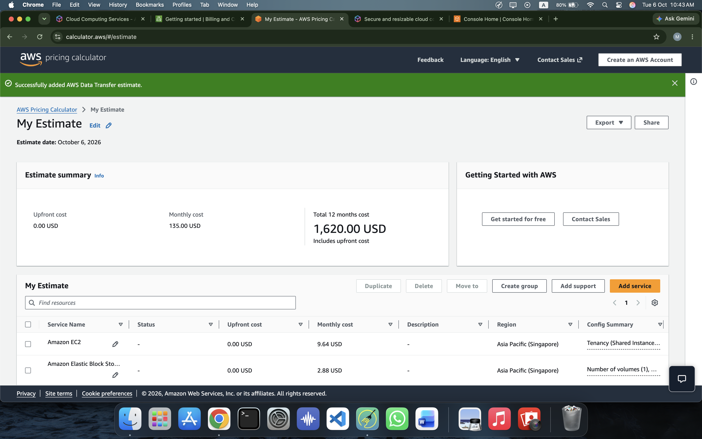
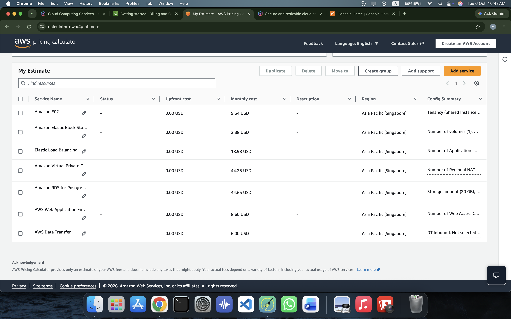
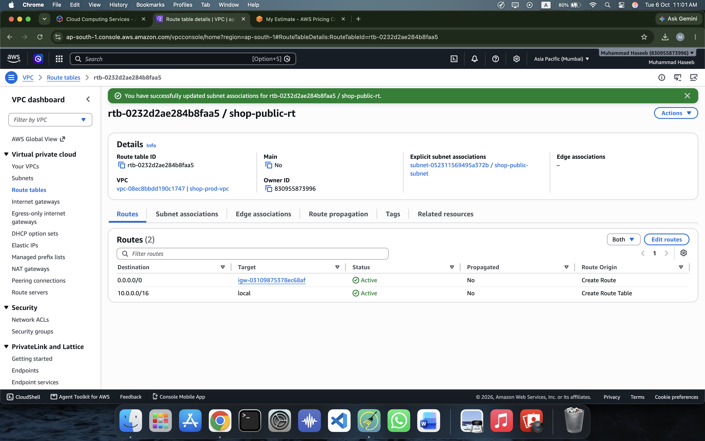
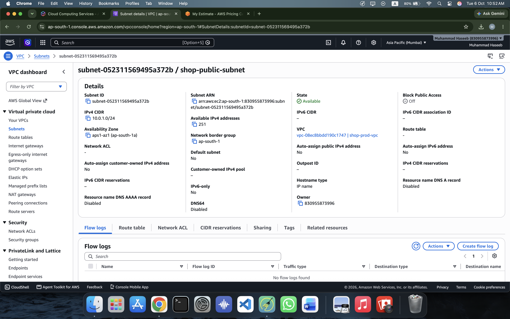
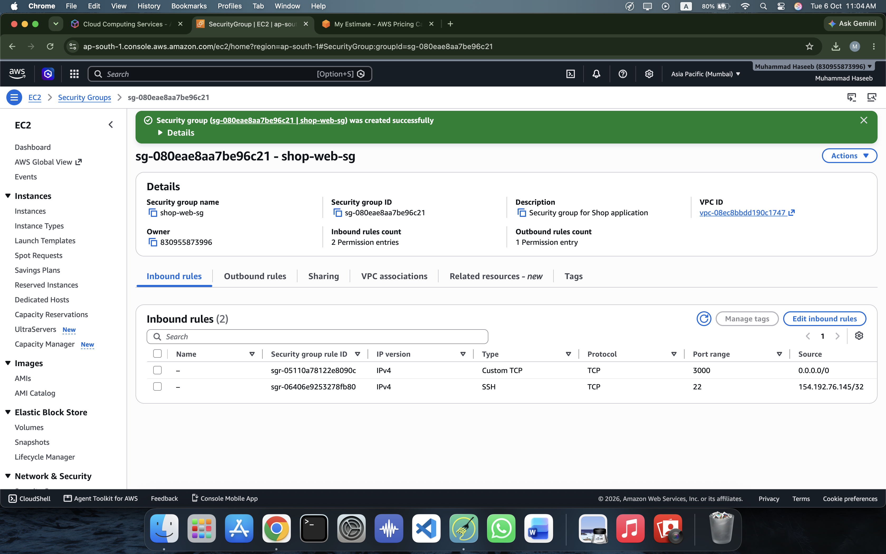
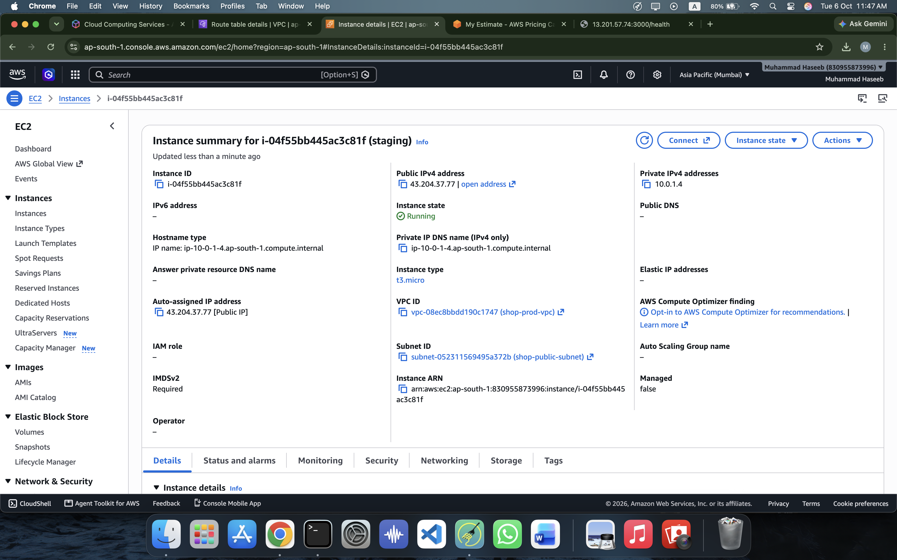
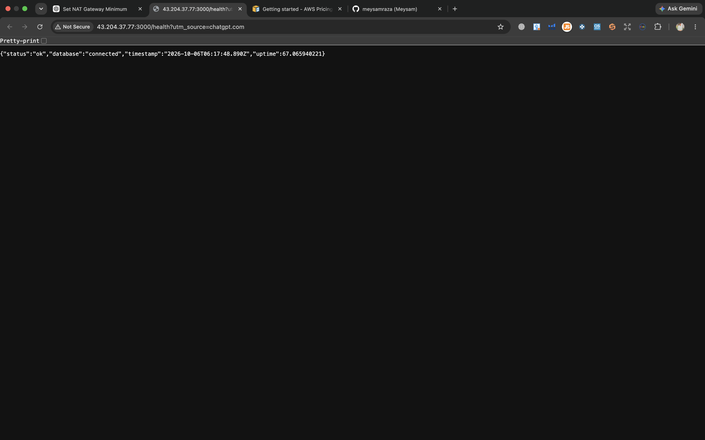
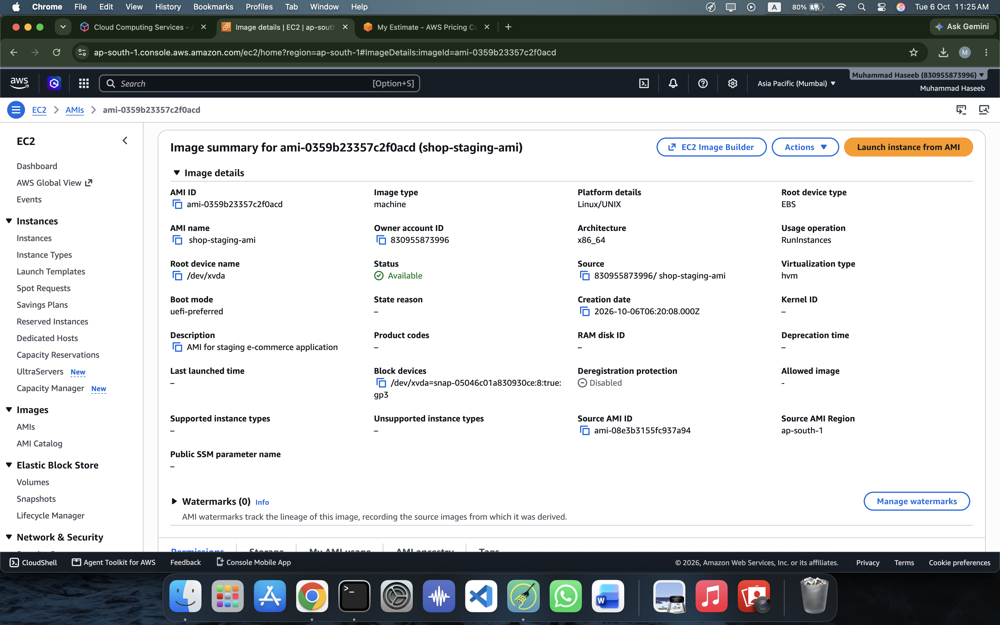
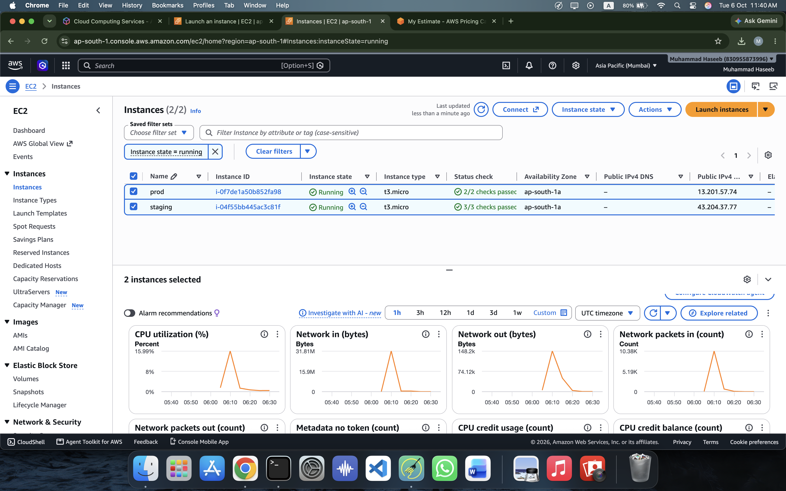
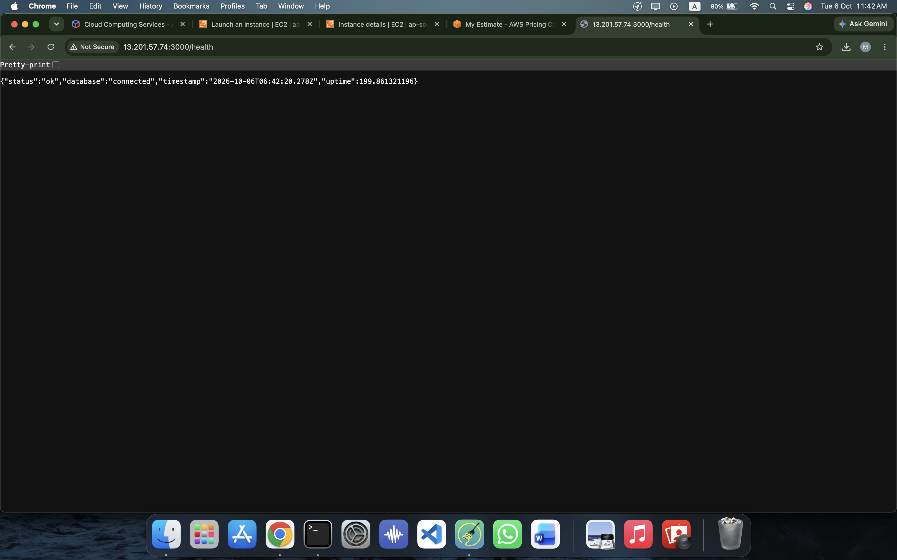

# Assignment 1 — DR Region Budget and First Deployment

> **DevOps Mentorship Program — Phase 2**
> **Deadline:** 9 October 2026
> **Main Region:** Asia Pacific (Mumbai)
> **DR Region:** Asia Pacific (Singapore)

---

## Overview

The objective of this assignment was to:

1. Estimate the monthly cost of a Disaster Recovery (DR) environment in AWS Singapore.
2. Build a small production-style environment in AWS Mumbai.
3. Deploy a staging application.
4. Create an AMI from the staging environment.
5. Launch a production instance from the AMI.
6. Verify application and database connectivity.

---

# Part A — DR Region Budget

The Disaster Recovery environment was estimated using **AWS Pricing Calculator** with Singapore selected as the DR region.

### Estimated Cost

| Cost      |            Amount |
| --------- | ----------------: |
| Upfront   |     **$0.00 USD** |
| Monthly   |   **$135.00 USD** |
| 12 Months | **$1,620.00 USD** |

### AWS Services Included

* Amazon EC2
* Amazon EBS
* Application Load Balancer
* Amazon VPC / NAT Gateway
* Amazon RDS for PostgreSQL
* AWS WAF
* AWS Data Transfer

### Cost Breakdown

| Service                   | Monthly Cost |
| ------------------------- | -----------: |
| EC2                       |        $9.64 |
| EBS                       |        $2.88 |
| Application Load Balancer |       $18.98 |
| VPC / NAT Gateway         |       $44.25 |
| RDS PostgreSQL            |       $44.65 |
| AWS WAF                   |        $8.60 |
| Data Transfer             |        $6.00 |
| **Total**                 |  **$135.00** |

### Pricing Calculator Configuration

The calculator was configured according to the assignment requirements for the Singapore DR region.



### Final Estimate

The final AWS Pricing Calculator estimate shows a monthly cost of **$135.00 USD** and a 12-month estimated cost of **$1,620.00 USD**.



The complete exported estimate is available here:

**[AWS-DR-Estimate.pdf](AWS-DR-Estimate.pdf)**

---

# Part B — First Deployment

## 1. VPC and Public Networking

A custom VPC was created in the Mumbai region.

### VPC Configuration

* **VPC Name:** `shop-prod-vpc`
* **CIDR:** `10.0.0.0/16`

### Public Subnet

* **Subnet Name:** `shop-public-subnet`
* **CIDR:** `10.0.1.0/24`
* **Availability Zone:** `ap-south-1a`

The public subnet was configured to use an Internet Gateway through a public route table.

### Route Table

The route table contains:

```text
0.0.0.0/0 → Internet Gateway
```

This allows resources in the public subnet to communicate with the internet.



### Public Subnet

The staging and production EC2 instances were deployed in the public subnet.



---

## 2. Security Group

A security group named `shop-web-sg` was created for the application servers.

### Inbound Rules

| Protocol | Port | Source      | Purpose            |
| -------- | ---: | ----------- | ------------------ |
| TCP      |   22 | My IP       | SSH administration |
| TCP      | 3000 | `0.0.0.0/0` | Application access |



The SSH rule was restricted to the administrator's IP address, while port 3000 was opened for accessing the application.

---

# 3. Staging EC2 Deployment

A staging EC2 instance was launched using:

* **Name:** `staging`
* **AMI:** Amazon Linux 2023
* **Instance Type:** `t3.micro`
* **VPC:** `shop-prod-vpc`
* **Subnet:** `shop-public-subnet`
* **Security Group:** `shop-web-sg`
* **Public IPv4:** `43.204.37.77`



---

## 4. Application Setup

The staging server was configured with:

* Node.js 20
* PostgreSQL 15
* Docker
* Git

The E-commerce application was cloned from the provided repository and configured to use PostgreSQL.

The database schema and seed data were initialized, and the application was configured as a `systemd` service.

This allowed the application to start automatically and restart if the process stopped.

---

## 5. Staging Health Check

The application was tested using the `/health` endpoint.

```text
http://43.204.37.77:3000/health
```

The health endpoint confirmed that both the application and database were working.



Expected response:

```json
{
  "status": "ok",
  "database": "connected"
}
```

---

# 6. AMI Creation

After successfully configuring and testing the staging environment, an Amazon Machine Image was created.

### AMI

**Name:** `shop-staging-ami`

The AMI captured the configured staging environment so that it could be reused to launch the production instance.



---

# 7. Production EC2 Deployment

The production EC2 instance was launched from the `shop-staging-ami` AMI.

### Production Configuration

* **Name:** `prod`
* **AMI:** `shop-staging-ami`
* **Instance Type:** `t3.micro`
* **VPC:** `shop-prod-vpc`
* **Subnet:** `shop-public-subnet`
* **Security Group:** `shop-web-sg`
* **Public IPv4:** `13.201.57.74`



> **Note:** The assignment specified `t2.medium` for the production instance. `t3.micro` was used during this lab deployment to minimize AWS costs.

---

# 8. Production Health Check

The production application was tested using:

```text
http://13.201.57.74:3000/health
```

The health endpoint confirmed that the application and PostgreSQL database were connected successfully.



Expected response:

```json
{
  "status": "ok",
  "database": "connected"
}
```

---

# 9. EC2 Information

The temporary EC2 instances used for this assignment were terminated after completing the lab to avoid unnecessary AWS charges.

Historical IP addresses and health-check URLs are documented in:

**[EC2-IPs.txt](EC2-IPs.txt)**

---

# 10. Key Learnings

Through this assignment, I gained hands-on experience with:

* AWS Pricing Calculator
* AWS VPC
* Public subnets
* Internet Gateway
* Route tables
* Security Groups
* Amazon EC2
* Amazon Linux 2023
* Node.js deployment
* PostgreSQL
* systemd services
* AMI creation
* EC2 deployment from an AMI
* Application health checks
* AWS cost management
* Infrastructure cleanup

---

# Repository Structure

```text
Assignment-01/
├── README.md
├── AWS-DR-Estimate.pdf
├── EC2-IPs.txt
└── Screenshots/
    ├── 01-DR-Budget-Calculator.png
    ├── 02-DR-Budget-Summary.png
    ├── 03-Route-Table.png
    ├── 04-Public-Subnet.png
    ├── 05-Security-Group.png
    ├── 06-Staging-EC2.png
    ├── 07-Staging-Health.png
    ├── 08-AMI.png
    ├── 09-Production-EC2.png
    └── 10-Production-Health.png
```

---

## Status

**Completed — 6 October 2026**
